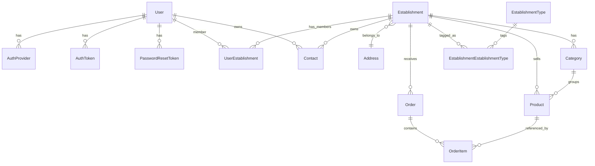

# Vendlyhub Backend - Data Models

**Date:** 2026-05-16
**Source of truth:** `app-backend/prisma/schema.prisma`
**Database:** PostgreSQL 18 (`postgres:18.1` image in `docker-compose.yml`)
**ORM:** Prisma 7 (`@prisma/client` + `@prisma/adapter-pg`)

This document is a derived view of `prisma/schema.prisma`. When the schema changes, regenerate this file or treat the schema as authoritative.

## Conventions

- All UUID primary keys use `@default(uuid())`.
- Column-level `@map(...)` and table-level `@@map(...)` translate Prisma's camelCase model names to snake_case SQL identifiers.
- Soft delete: `deletedAt` is present on `Establishment`, `Category`, and `Product`. Hard delete cascades are configured per relation as documented below.
- Money columns are `Decimal(10, 2)`.
- All migrations are append-only and live under `prisma/migrations/`. Latest migrations on disk:
  - `20260323105156_init`
  - `20260330120000_product_management`
  - `20260330203124`
  - `20260330220000_establishment_types_m2m`
  - `20260409120000_minimal_onboarding_hardening`
  - `20260410030650`
  - `20260511015000_catalog_mobile_number_slug`
  - `20260511024000_add_pix_copy_paste_to_establishment`

## Entity-Relationship Diagram



## Models

### User (`user`)

User identity and credentials.

| Field | Type | Constraints | Notes |
|---|---|---|---|
| `userId` | `String` | `@id @default(uuid()) @map("user_id")` | PK |
| `email` | `String` | `@unique` | login identifier |
| `passwordHash` | `String` | `@map("password_hash")` | bcrypt hash |
| `name` | `String?` | – | display name |
| `avatar` | `String?` | – | URL path under `/uploads/avatars/...` |
| `isActive` | `Boolean` | `@default(true) @map("is_active")` | – |
| `lastLoginAt` | `DateTime?` | `@map("last_login_at")` | updated on login |
| `createdAt`, `updatedAt` | `DateTime` | timestamps | – |

**Relations:** `authProviders` (1:N `AuthProvider`), `authTokens` (1:N `AuthToken`), `passwordResetTokens` (1:N), `userEstablishments` (N:M membership rows), `contacts` (1:N `Contact` rows whose owner is this user).

---

### AuthProvider (`auth_provider`)

Links a user to an external identity provider (Google, Apple, …) or registers an `email` provider entry.

| Field | Type | Constraints | Notes |
|---|---|---|---|
| `authProviderId` | `String` | `@id @default(uuid())` | PK |
| `userId` | `String` | `@map("user_id")` | FK → `User` (cascade) |
| `provider` | `AuthProviderType` | – | `google` \| `email` \| `apple` |
| `providerId` | `String` | `@map("provider_id")` | provider-side user ID |
| `createdAt` | `DateTime` | `@default(now())` | – |

**Indexes:** `@@unique([provider, providerId])`, `@@unique([userId, provider])`.

---

### Establishment (`establishment`)

Tenant-equivalent entity owning the catalog and orders.

| Field | Type | Constraints | Notes |
|---|---|---|---|
| `establishmentId` | `String` | PK | – |
| `name` | `String` | – | – |
| `document` | `String?` | `@unique` | CPF or CNPJ |
| `documentType` | `DocumentType?` | `@map("document_type")` | `cpf` \| `cnpj` |
| `onboardingStatus` | `OnboardingStatus` | default `draft` | `draft` \| `minimal_completed` \| `completed` |
| `pixCopyPaste` | `String?` | `@map("pix_copy_paste")` | added by `20260511024000_add_pix_copy_paste_to_establishment` |
| `logo` | `String?` | – | URL path under `/uploads/logos/...` |
| `addressId` | `String` | `@map("address_id")` | FK → `Address` |
| `isActive` | `Boolean` | default `true` | – |
| `deletedAt` | `DateTime?` | – | soft-delete |
| `createdAt`, `updatedAt` | `DateTime` | – | – |

**Relations:** `address` (M:1 `Address`), `userEstablishments` (1:N), `contacts` (1:N), `categories` (1:N), `products` (1:N), `orders` (1:N), `establishmentEstablishmentTypes` (1:N — the join model that tags the establishment with one or more `EstablishmentType`s).

---

### EstablishmentType (`establishment_type`) and EstablishmentEstablishmentType (`establishment_establishment_type`)

Many-to-many between establishments and a curated catalog of business types (e.g. `Restaurantes`, `Pizzarias`). Added by migration `20260330220000_establishment_types_m2m`.

```prisma
model EstablishmentType {
  establishmentTypeId String @id @default(uuid()) @map("establishment_type_id")
  name                  String @unique
  ...
}

model EstablishmentEstablishmentType {
  establishmentId     String
  establishmentTypeId String
  ...
  @@id([establishmentId, establishmentTypeId])
}
```

Both sides cascade on delete.

---

### Address (`address`)

Standalone address aggregate referenced by `Establishment.addressId`.

| Field | Type | Notes |
|---|---|---|
| `addressId` | `String` | PK |
| `cep`, `street`, `number`, `complement`, `neighborhood`, `city`, `state` | `String?` | All optional |

**Relations:** `establishments` (1:N).

---

### Contact (`contact`)

Polymorphic owner contact. Either user-owned or establishment-owned.

| Field | Type | Constraints | Notes |
|---|---|---|---|
| `contactId` | `String` | PK | – |
| `ownerType` | `OwnerType` | `@map("owner_type")` | `user` \| `establishment` |
| `ownerId` | `String` | `@map("owner_id")` | logical owner FK |
| `contactType` | `ContactType` | `@map("contact_type")` | `phone_number` \| `mobile_number` \| `email` |
| `value` | `String` | – | actual value |
| `label` | `String?` | – | – |
| `isPrimary` | `Boolean` | default `false` | – |
| `userId` | `String?` | nullable FK → `User` (cascade) | populated when `ownerType=user` |
| `establishmentId` | `String?` | nullable FK → `Establishment` (cascade) | populated when `ownerType=establishment` |
| `createdAt`, `updatedAt` | `DateTime` | – | – |

**Indexes:** `@@index([ownerId, ownerType])`.

---

### UserEstablishment (`user_establishment`)

N:M membership of users in establishments with role and onboarding flags.

| Field | Type | Constraints | Notes |
|---|---|---|---|
| `userId` | `String` | composite PK | FK → `User` (cascade) |
| `establishmentId` | `String` | composite PK | FK → `Establishment` (cascade) |
| `role` | `UserRole` | `owner` \| `admin` \| `staff` | – |
| `loginWhatsapp` | `String?` | `@unique @map("login_whatsapp")` | added by `20260511015000_catalog_mobile_number_slug` (acts as alternative login identifier) |
| `minimalProfileCompleted` | `Boolean` | default `true` | added by `20260409120000_minimal_onboarding_hardening` |

**PK:** `@@id([userId, establishmentId])`.

---

### AuthToken (`auth_token`)

Refresh tokens, hashed at rest. Issued on login/register flows that return tokens, revoked on logout.

| Field | Type | Constraints | Notes |
|---|---|---|---|
| `authTokenId` | `String` | PK | – |
| `userId` | `String` | FK → `User` (cascade) | – |
| `refreshTokenHash` | `String` | `@map("refresh_token_hash")` | bcrypt hash of the UUID issued to the client |
| `expiresAt` | `DateTime` | – | new sessions: `now + 7d` |
| `revokedAt` | `DateTime?` | – | set on logout |
| `device`, `ip` | `String?` | – | optional metadata |
| `createdAt` | `DateTime` | default `now()` | – |

**Indexes:** `@@index([userId])`, `@@index([expiresAt])`.

---

### PasswordResetToken (`password_reset_token`)

Hashed reset tokens with single-use semantics (`usedAt`).

| Field | Type | Constraints |
|---|---|---|
| `passwordResetTokenId` | `String` | PK |
| `userId` | `String` | FK → `User` (cascade) |
| `resetTokenHash` | `String` | `@map("reset_token_hash")` |
| `expiresAt` | `DateTime` | – |
| `usedAt` | `DateTime?` | set when consumed |
| `createdAt` | `DateTime` | default `now()` |

**Indexes:** `@@index([userId])`.

---

### Category (`category`)

Establishment-scoped category.

| Field | Type | Constraints | Notes |
|---|---|---|---|
| `categoryId` | `String` | PK | – |
| `establishmentId` | `String` | FK → `Establishment` (cascade) | – |
| `name` | `String` | unique within establishment | – |
| `description` | `String?` | – | – |
| `status` | `CategoryStatus` | default `active` | `active` \| `inactive` |
| `createdAt`, `updatedAt`, `deletedAt` | `DateTime`, optional `deletedAt` | soft-delete | – |

**Indexes:** `@@unique([establishmentId, name])`, `@@index([establishmentId, status])`.

---

### Product (`product`)

Establishment+category-scoped product. Soft-deletable.

| Field | Type | Constraints | Notes |
|---|---|---|---|
| `productId` | `String` | PK | – |
| `establishmentId` | `String` | FK → `Establishment` (cascade) | – |
| `categoryId` | `String` | FK → `Category` (`onDelete: Restrict`) | – |
| `name` | `String` | – | – |
| `sku` | `String` | unique within establishment (`@@unique([establishmentId, sku])`) | auto-generated when omitted |
| `brand`, `model`, `description`, `unit`, `supplier` | `String` | – | – |
| `salePrice` | `Decimal(10, 2)` | – | – |
| `discount`, `cost`, `margin` | `Decimal(10, 2)` | defaults `0` for `discount` and `margin` | – |
| `stockQuantity`, `reservedStock`, `soldQuantity`, `minStock` | `Int` | counters | – |
| `supplierCode` | `String?` | – | – |
| `ean` | `String?` | – | – |
| `status` | `ProductStatus` | default `active` | – |
| `imageUrl` | `String?` | – | URL path under `/uploads/products/...` |
| `createdAt`, `updatedAt`, `deletedAt` | `DateTime` (`deletedAt` optional) | soft-delete | – |

**Indexes:** `@@unique([establishmentId, sku])`, `@@index([establishmentId, categoryId, status])`.

---

### Order (`order`) and OrderItem (`order_item`)

Order placed by a public buyer against an establishment's catalog.

```prisma
model Order {
  orderId          String      @id @default(uuid())
  establishmentId  String      // FK → Establishment (cascade)
  orderNumber      String      @unique
  status           OrderStatus @default(pending)
  customerName     String
  customerWhatsapp String
  customerAddress  String
  notes            String?
  totalAmount      Decimal     @db.Decimal(10, 2)
  ...
  @@index([establishmentId, createdAt])
}

model OrderItem {
  orderItemId String  @id @default(uuid())
  orderId     String  // FK → Order (cascade)
  productId   String  // FK → Product (Restrict)
  quantity    Int
  unitPrice   Decimal @db.Decimal(10, 2)
  discount    Decimal @default(0) @db.Decimal(10, 2)
  lineTotal   Decimal @db.Decimal(10, 2)
  ...
  @@index([orderId])
  @@index([productId])
}
```

`OrderStatus` ∈ `pending | confirmed | cancelled`. Public order creation enters `pending`; admin confirmation moves to `confirmed`.

---

## Enums

```prisma
enum AuthProviderType { google email apple }
enum DocumentType     { cpf cnpj }
enum OwnerType        { user establishment }
enum ContactType      { phone_number mobile_number email }
enum UserRole         { owner admin staff }
enum CategoryStatus   { active inactive }
enum ProductStatus    { active inactive }
enum OrderStatus      { pending confirmed cancelled }
enum OnboardingStatus { draft minimal_completed completed }
```

## Cascade and Delete Semantics

- **Cascade on parent delete (cleans up children):**
  - `User` → `AuthProvider`, `AuthToken`, `PasswordResetToken`, `UserEstablishment`, `Contact (user-owned)`.
  - `Establishment` → `UserEstablishment`, `Contact (establishment-owned)`, `Category`, `Product`, `Order`, `EstablishmentEstablishmentType`.
  - `EstablishmentType` ↔ `EstablishmentEstablishmentType` (both sides cascade).
  - `Order` → `OrderItem`.
- **Restrict (parent deletion blocked while children exist):**
  - `Category` → `Product` (`onDelete: Restrict` on `Product.categoryId`).
  - `Product` → `OrderItem` (`onDelete: Restrict` on `OrderItem.productId`).

Soft delete on `Establishment`, `Category`, `Product` (`deletedAt`) is enforced by application code — list queries should filter `deletedAt: null`.

## Migration History (high-level)

| Migration | Purpose |
|---|---|
| `20260323105156_init` | Initial schema: users, sessions, establishments, addresses, contacts, password reset, auth tokens. |
| `20260330120000_product_management` | Adds `Category`, `Product`, related indexes. |
| `20260330203124` | Auxiliary changes (likely small fixups around product management). |
| `20260330220000_establishment_types_m2m` | Replaces the previous single-type column with the `EstablishmentType` + `EstablishmentEstablishmentType` join. |
| `20260409120000_minimal_onboarding_hardening` | Adds `UserEstablishment.minimalProfileCompleted` etc. |
| `20260410030650` | Auxiliary changes around onboarding. |
| `20260511015000_catalog_mobile_number_slug` | Adds slug-based catalog (mobile number / WhatsApp on `UserEstablishment.loginWhatsapp`); enables `/catalog/:slug`. |
| `20260511024000_add_pix_copy_paste_to_establishment` | Adds `Establishment.pixCopyPaste`. |

## Operational Notes

- **Local DB:** `docker compose up -d` from the repo root starts `postgres:18.1` on host port `5439` with database `vendlyhub`, user `gandalf`, password `gandalf123` (dev only). Set the backend `DATABASE_URL` to point at it.
- **Reset to a clean state:** `prisma/reset-initial-state.sql` provides a manual reset.
- **Migrations:** create new ones with `pnpm --filter vendlyhub-backend prisma:migrate:dev --name <change>`. Apply in production with `prisma:migrate:deploy`.
- **Studio:** `pnpm --filter vendlyhub-backend prisma:studio` for ad-hoc inspection.

---

_Generated using BMAD Method `document-project` workflow_
