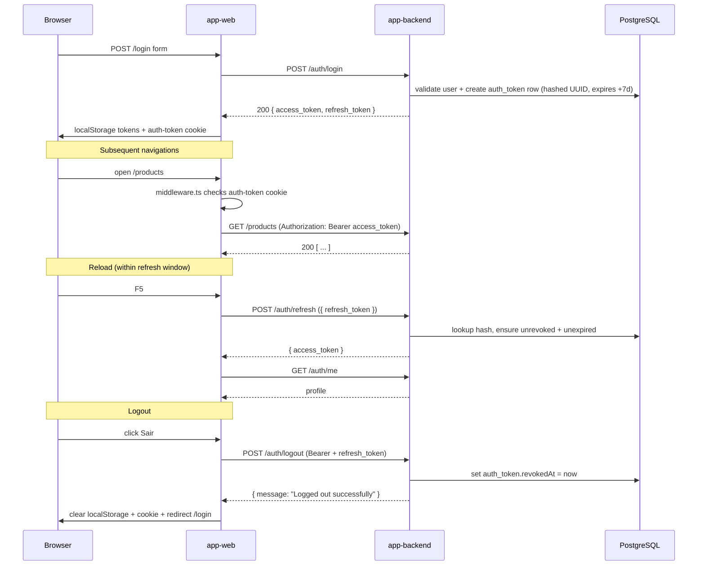
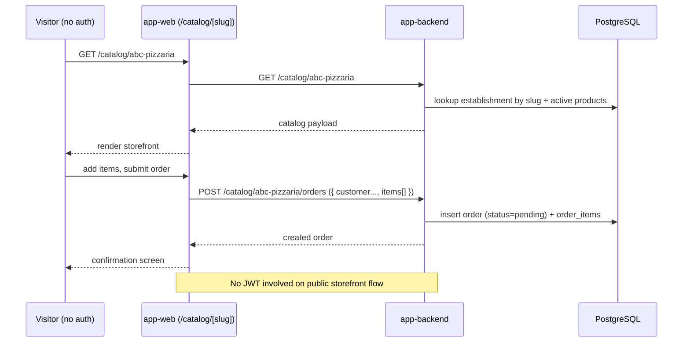

# Vendlyhub - Integration Architecture

**Date:** 2026-05-16

How the Vendlyhub apps integrate with each other and with external systems.

## High-level diagram

```mermaid
flowchart LR
    subgraph "Browser"
        SPA["app-web (Next.js 15)\nReact 19 client"]
    end

    subgraph "Vendlyhub server"
        APP["app-backend (NestJS 11)\nExpress + Prisma"]
        FS[("Filesystem\n/uploads/{logos,avatars,products}")]
        APP -- "express.static('/uploads', UPLOADS_ROOT)" --> FS
    end

    DB[("PostgreSQL 18.1\n(localhost:5439 in dev)")]
    SMTP[(("SMTP")):::ext]
    GOOG[(("Google OAuth")):::ext]

    SPA -- "REST/JSON\nAxios apiClient + Bearer JWT" --> APP
    APP -- "Prisma 7" --> DB
    APP -- "nodemailer" --> SMTP
    APP -- "passport-google-oauth20\n(only if GOOGLE_CLIENT_ID set)" --> GOOG
    SPA -- "GET /uploads/..." --> FS

    classDef ext stroke-dasharray: 5 5;
```

## Integration points

### 1. `app-web` → `app-backend` (REST/JSON)

- **Channel:** HTTPS (HTTP in dev) over `Axios apiClient` configured in `app-web/src/app/services/apiClient.ts`.
- **Base URL:** `process.env.NEXT_PUBLIC_API_URL` (inlined at build time).
- **Auth:** Bearer JWT (`Authorization: Bearer <access_token>`). The same access token is mirrored into a `auth-token` cookie used by Next.js `middleware.ts` for edge-side route gating.
- **Refresh:** Long-lived UUID refresh tokens (7 days, hashed server-side in `auth_token`). The client sends the refresh token in the body of `POST /auth/refresh` and receives a new access token (refresh tokens are not rotated).
- **Error handling:** the response interceptor calls `forceClientLogout` on a 401 from any authenticated request, or on a 404 whose body message contains `"user not found"` — in both cases the client clears `localStorage`, removes the cookie, dispatches `AUTH_INVALID_SESSION_EVENT`, and redirects to `/login?redirect=<path>`.
- **Force-logout signal:** `AUTH_INVALID_SESSION_EVENT` is a custom window event that `AuthContext` listens to in order to clear React state (`setUser(null)`).

#### Concrete API surface used by `app-web`

Authenticated:

| Backend route | Web caller | Used by |
|---|---|---|
| `POST /auth/login` | `authService.login` | `/login` page, `AuthContext.login` |
| `POST /auth/register` | `authService.register` | `/register` page, `AuthContext.register` |
| `POST /auth/register-minimal` | `authService.registerMinimal` | `/fast-onboarding` page, `AuthContext.registerMinimal` |
| `POST /auth/refresh` | `authService.refreshToken` | `AuthContext.checkAuth` on mount |
| `POST /auth/logout` | `authService.logout` | `AuthContext.logout` |
| `POST /auth/forgot-password` | `authService.forgotPassword` | `/esqueci-senha` page |
| `POST /auth/reset-password` | `authService.resetPassword` | `/redefinir-senha` page |
| `GET /auth/me` / `PATCH /auth/me` | `profileService.getProfile / updateProfile` | `AuthContext.checkAuth`, `/profile` |
| `PATCH /auth/establishment` / `establishment/pix` / `establishment/logo` | service calls in `establishment` page | `/establishment` |
| `POST /auth/onboarding/complete` | post-onboarding helper (`lib/postOnboarding.ts`) | onboarding flows |
| `GET /categories`, `POST/PATCH/DELETE /categories/:id` | `categoryService` | `/categories` |
| `GET /products`, `GET /products/:id`, `POST/PATCH/DELETE /products` | `productService` | `/products` |
| `GET /orders`, `PATCH /orders/:id/confirm` | `orderService` | `/orders` |

Public:

| Backend route | Web caller | Used by |
|---|---|---|
| `GET /catalog/:slug` / `GET /catalog/:slug/highlighted` | `catalogService` | `/catalog/[slug]`, `/catalog/preview` |
| `POST /catalog/:slug/orders` | `catalogService` (or `orderService` public path) | `/catalog/[slug]` checkout |

### 2. `app-web` → `app-backend` (static files)

- **Channel:** plain HTTP `GET /uploads/...` served by raw Express static middleware mounted before NestJS routes (see `app-backend/src/main.ts`).
- **Stored values:** entity columns persist URL paths like `Establishment.logo = '/uploads/logos/<file>'`, `User.avatar = '/uploads/avatars/<file>'`, `Product.imageUrl = '/uploads/products/<file>'`.
- **Client builder:** `app-web/src/app/services/mediaUrl.ts` prepends `NEXT_PUBLIC_API_URL` to construct an absolute URL.

### 3. `app-backend` → PostgreSQL

- **ORM:** Prisma 7 (`@prisma/client` + `@prisma/adapter-pg`).
- **Where:** `app-backend/src/shared/prisma/prisma.service.ts` is the single Prisma boundary. Only this directory imports `@prisma/client`; feature modules consume it through repository abstractions or directly via `PrismaService`.
- **Transactions:** `TransactionService` (also under `shared/prisma/`) wraps multi-step writes. `RegisterUserUseCase` uses it to atomically create user + establishment + address + contacts.
- **Connection:** `DATABASE_URL` env var. The dev `docker-compose.yml` exposes Postgres on host port `5439`.

### 4. `app-backend` → SMTP (password reset)

- **Where:** `app-backend/src/modules/sessions/services/mail.service.ts`, used by `RequestPasswordResetUseCase`.
- **Channel:** `nodemailer` SMTP transport.
- **Trigger:** `POST /auth/forgot-password` sends a single-use token email; the client redeems it via `POST /auth/reset-password`.

### 5. `app-backend` → Google OAuth (optional)

- **Where:** `app-backend/src/modules/sessions/strategies/google.strategy.ts`. `GoogleStrategy` is **conditionally** added to `SessionsModule` providers only when `GOOGLE_CLIENT_ID` is set in the env (see `sessions.module.ts`). The dependent endpoints `GET /auth/google` and `GET /auth/google/callback` therefore exist only in environments configured for OAuth.
- **Client kick-off:** `AuthContext.googleLogin()` does `window.location.href = ${NEXT_PUBLIC_API_URL}/auth/google`.
- **Callback hand-off:** the backend redirects the browser to:
  - Success: `${FRONTEND_URL}/auth/callback?access_token=...&refresh_token=...`
  - Failure: `${FRONTEND_URL}/login?error=auth_failed`
- **Web side:** `app-web/src/app/auth/callback/page.tsx` parses the query string and calls `AuthContext.handleOAuthCallback(accessToken, refreshToken)`.

## CORS and cookies

`app-backend/src/main.ts`:

```ts
app.enableCors({
  origin: process.env.FRONTEND_URL || 'http://localhost:3001',
  methods: 'GET,HEAD,PUT,PATCH,POST,DELETE,OPTIONS',
  credentials: true,
});
```

- A **single origin** is allowed; multi-origin clients are not supported without code changes.
- `credentials: true` is required because the web client mirrors the access JWT into a `auth-token` cookie used by `middleware.ts`. The cookie is set client-side (not HttpOnly), so it does not need backend `Set-Cookie` support.
- The web client itself currently sends the access token as a Bearer header (Axios interceptor) rather than as a cookie on the API call. The cookie is purely for Next.js middleware.

## Auth-token lifecycle



## Public storefront flow



## Cross-app contract risks

- **Slug-based public surface:** `/catalog/:slug` relies on a slug stored on the establishment. Renaming or migrating the slug column requires coordinated changes to both apps and the `app-web/src/middleware.ts` `PUBLIC_ROUTE_PREFIXES`.
- **Token storage choice:** access/refresh tokens live in `localStorage`, which is XSS-readable. The cookie copy is also non-HttpOnly. Tightening this to HttpOnly cookies would change both auth handler responses and middleware logic.
- **Single CORS origin:** swapping to multiple environments requires code in `main.ts` (e.g. allow an array, or echo the request origin against an allowlist).
- **No refresh-token rotation:** an exfiltrated refresh token is valid until expiry (7 days). Consider rotating on `POST /auth/refresh` if higher security is required.
- **Console logging of tokens:** `AuthContext.storeAuthData` currently logs the access and refresh tokens. Remove before any production deploy.

## Where to look in the codebase

| Concern | Files |
|---|---|
| Web HTTP entry to API | `app-web/src/app/services/apiClient.ts`, `app-web/src/app/services/authSession.ts` |
| Auth state on web | `app-web/src/app/contexts/AuthContext.tsx`, `app-web/src/middleware.ts`, `app-web/src/app/config/navigation.ts` |
| Backend auth | `app-backend/src/modules/sessions/**` |
| Backend bootstrap (CORS, /uploads, Swagger) | `app-backend/src/main.ts` |
| Prisma boundary | `app-backend/src/shared/prisma/**`, `app-backend/prisma/schema.prisma` |
| Public storefront | `app-backend/src/modules/catalog/**`, `app-backend/src/modules/orders/orders.controller.ts`, `app-web/src/app/catalog/**` |

---

_Generated using BMAD Method `document-project` workflow_
